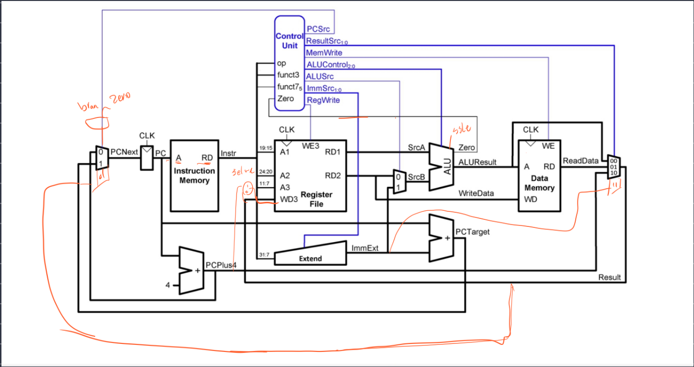
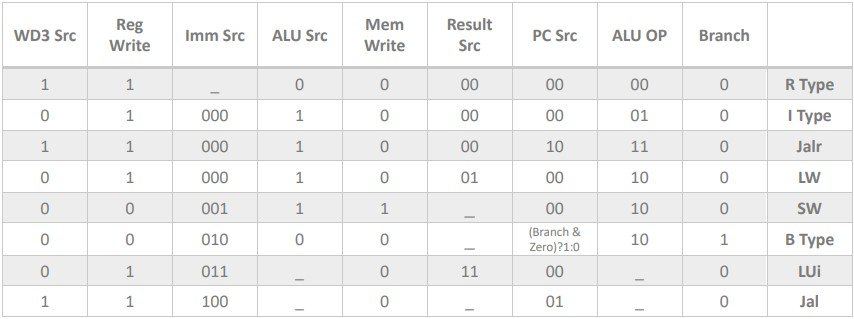
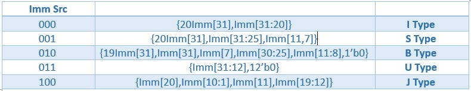
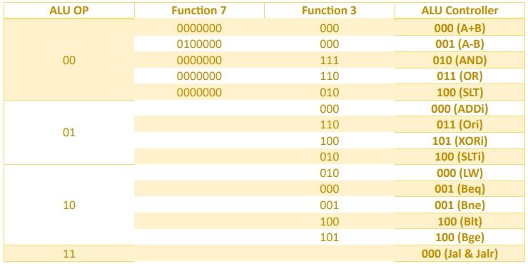
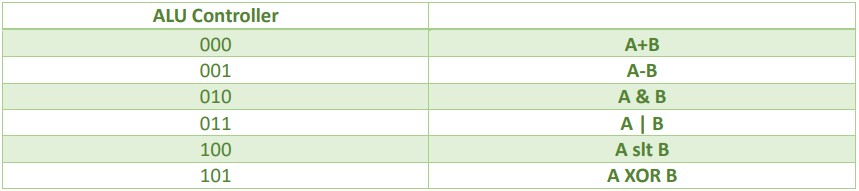

# Single Cycle RISC-V Processor

Design and implementation of RISC-V processor with a single-cycle datapath and controller.

## Commands

```ruby
R_Type:  add, sub, and, or, slt
```
```ruby
I_Type:  lw, addi, xori, ori, slti, jalr
```
```ruby
S_Type:  sw
```
```ruby
J_Type:  jal
```
```ruby
B_Type:  beq, bne, blt, bge
```
```ruby
U_Type:  lui
```
## Datapath


## Controller


### Immediate Extension Unit Controller


### ALU Opcode Controller


### ALU Controller


## Test Code
The following assembly code can be converted to machine code using [RISC-V Online Assembler](https://riscvasm.lucasteske.dev/#).

```ruby
add X7,X0,X0;
addi X6,X0,10;
Loop:
beq X7,X6,end;
slti X8,X7,2;
lw X1,A(X8)
if:
 slt X9,X12,X11;
beq X9,X0,end-if;
add X12,X0,X11;
end-if:
addi X7,X7,1;
J Loop;
end:

```
## Course Description
- **Course**: Digital Systems 2 [ECE 778]
- **Semester**: Spring 2023
- **Institution:** [School of Electrical & Computer Engineering](https://ece.ut.ac.ir/en/), [College of Engineering](https://eng.ut.ac.ir/en), [University of Tehran](https://ut.ac.ir/en)
- **Instructors:** Dr. Safari